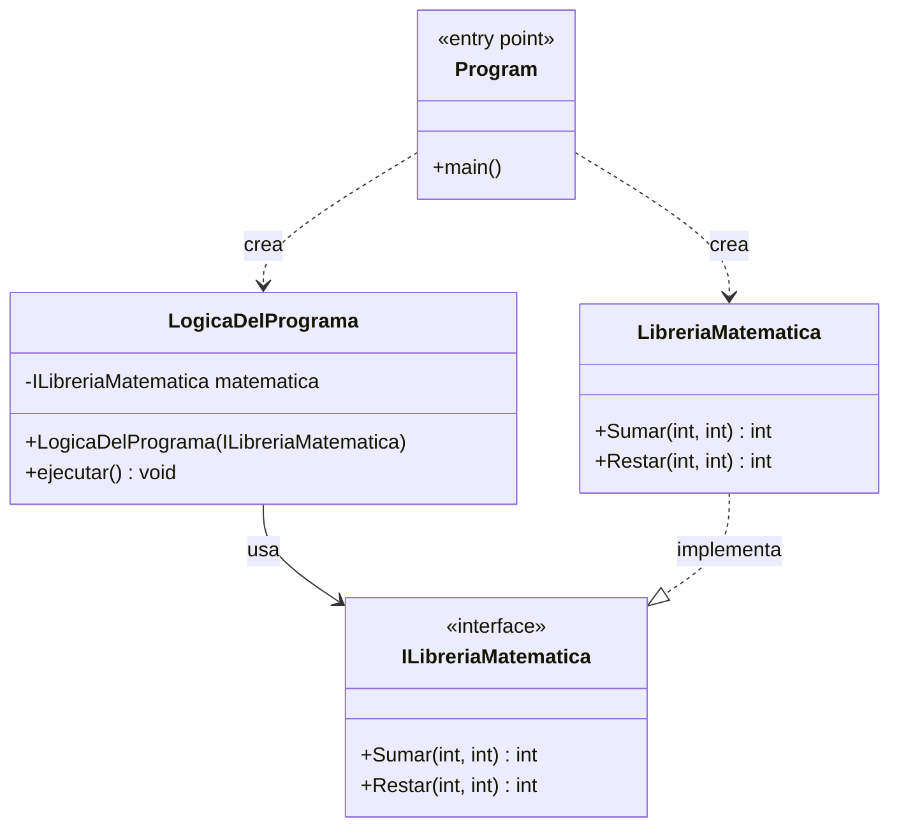

# Diagrama de paquetes

Las dependencias son las referencias entre proyectos.

                    LibreriaMatematica2     < LibreriaMatematica2.Test
                        ^           V
                    AppConsola      v       < AppConsola.Test
                        v           v
                    LibreriaMatematicaAPI    


Class LibreriaMatematica2 < Proyecto: MiNuevaLibreriaMatematica

# Diagrama de clases:

Las dependencias aquí son los using;

    Program.cs > LogicaDelPrograma.cs 
               > LibrariaMatematica.cs > ILibreriaMatematica.cs


---


    Especificacion Bicicleta:

        Especificacion del sistema de frenos API  <  Shimano XJ19289
                            v
        Especificacion de las ruedas API          <  Michelín 1234
                                                  <  Pirelli 132384  
    Bicicleta concreta que vengo:
        Shimano XJ19289
        Pirelli 132384

# UML

UML Es un lenguaje de pintar graficos.

Cambia el tema con UML en el momento en que dejamos de tener que pintar gráficos.
Hoy en día ya no pinto gráficos... los escribo.

Tenemos lenguajes que me permiten escribir esos gráficos y hay motores de procesamiento que luego generan los gráficos de forma automática desde el texto que yo he escrito:
- Mermaid
- PlantUML

Y la gracia real.. es que hoy en día, ni los escribo.. se lo pido a unos coleguitas que escriben mejor que yo: IAs

---

Quiero un gráfico Mermaid con el diagrama de clases de mi app:




```csharp
using LibreriaMatematica;
using AppConsola;   

LibreriaMatematica libreriaAUsar = new LibreriaMatematica.LibreriaMatematica();
```


---


# Inversión de Control

Es un patrón de diseño que consiste delegar el control del flujo de ejecución del programa, a un tercero, que recibe el nombre de contenedor de inversión de control.

Cuando escribo código, mi código tiene varias partes:
- Defino clases, con métodos...
- Defino interfaces
- Defino la función de arranque del programa: main()

Esa función main es realmente el programa que se ejecuta.
El resto no es programa... son obetos que usa mi programa. 

En la función main es donde defino el FLUJO DE EJECUCIÓN del programa. Es decir, el orden en el que se van a ejecutar las distintas partes del programa.

Hay librerias que me permiten delegarles la creación de mi método main()... es decir, poner el flujo de ejecución del programa en manos de un tercero (la libreria; Contenedor de inversión de control)... y eso es lo que se llama inversión de control.

En .net, El HOST de la aplicación es el contenedor de inversión de control. Es decir, el programa que se ejecuta cuando arranco mi aplicación, es un programa que me ofrece .net, que se llama Host, y ese programa es el que se encarga de ejecutar mi código.


El host me permite:
- Leer configuraciones de un fichero de configuración: appsettings.json
- Crea un Service Provider, que es un contenedor de inyección de dependencias, que me permite registrar mis clases e interfaces, y luego inyectarlas en mi código.
---

Quiero montar un ETL (Extract, Transform, Load)

REQUISITOS FUNCIONALES:

- Quiero que cuando acabe me mande otro email!
- Quiero que el programa los datos que lea los lleve a una BBDD MariaDB, en la tabla Personas
- Quiero que cuando empiece el programa me mande un email!
- Quiero que si la persona tiene menos de 18 años, a la basura!
- Quiero que los datos los lea de un fichero csv
- Quiero que de cada persona valide el email. Y la fecha de nacimiento. Si no son válidos, a la barura.

    Lenguaje declarativo

FLUJO DE EJECUCIÓN: main()

    IMPERATIVO!

    mandaEmail("El programa ha empezado")

    datos = leeFichero("datos.csv")

    foreach (dato in datos)
    {
        if (!validarEmail(dato.email) || !validarFechaNacimiento(dato.fechaNacimiento))
        {
            continue; // a la basura
        }
        
        if (calcularEdad(dato.fechaNacimiento) < 18)
        {
            continue; // a la basura
        }
        
        guardaEnBBDD(dato);
    }

    mandaEmail("El programa ha acabado")

---


.net nos ofrece un contenedor de inversión de control... es parte del API de .net.
En java también tengo un contenedor de inversión de control... pero no es parte del api de java.. es un framework externo que tengo que añadir a mi proyecto: Spring