# 🏛️ Arquitectura - Diccionarios App

Este documento contiene los diagramas de clases y componentes del proyecto.

---

## 📦 Diagramas de Clases por Componente

### Diccionarios.Api

Interfaces base del dominio:

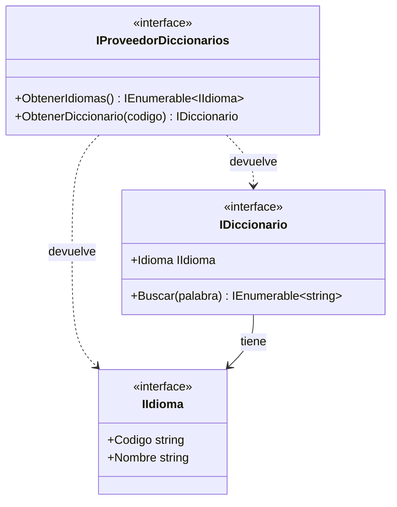

---

### Diccionarios.Ficheros

Implementación basada en archivos .txt:

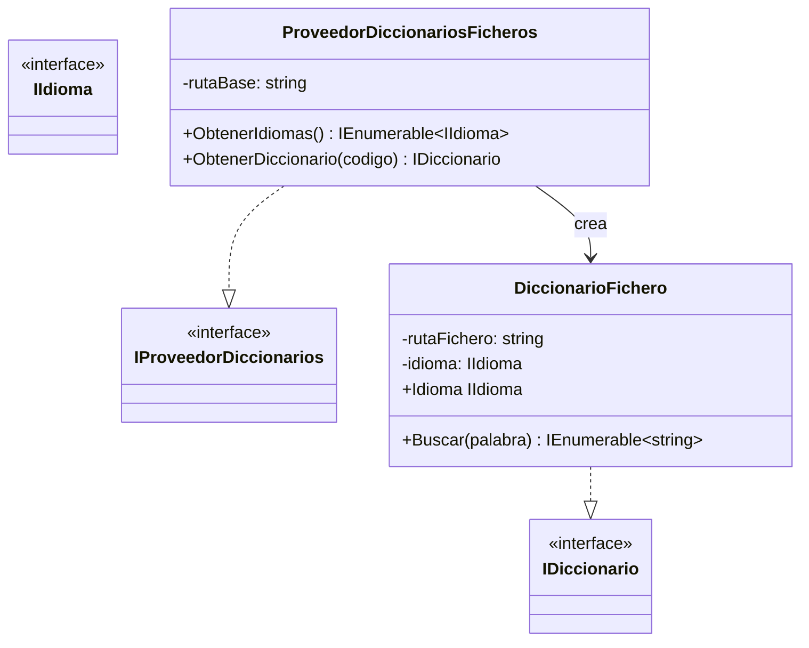

---

### Diccionarios.BBDD

Implementación con Entity Framework + SQLite:

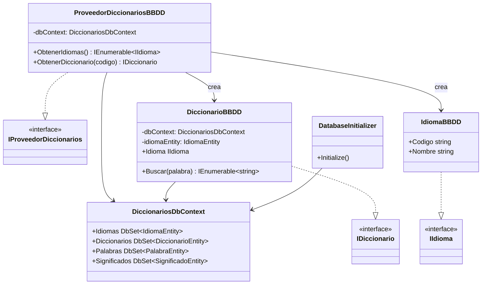

#### Entidades de Base de Datos

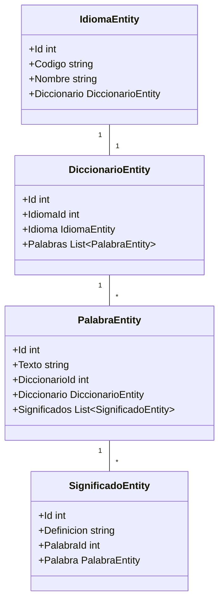

---

### Servicio.Api

Contrato del servicio de aplicación:

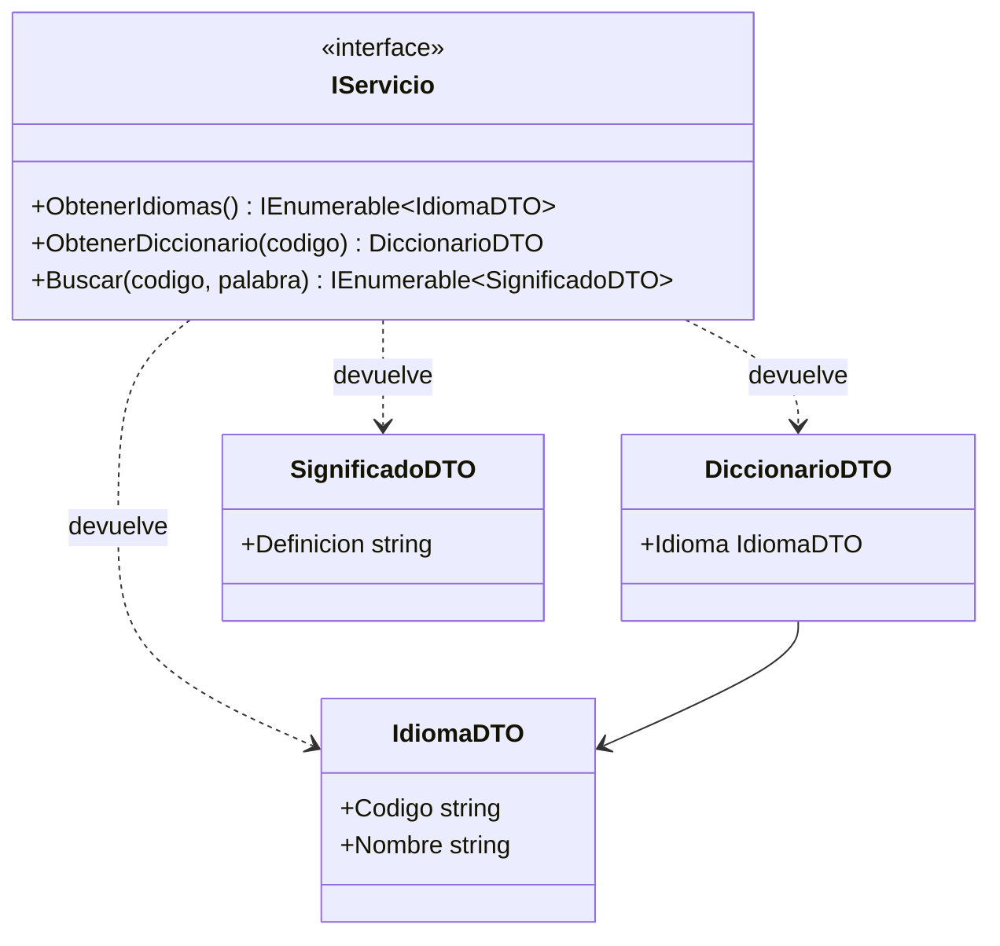

---

### Servicio.Impl

Implementación con patrón Decorator para AOP:

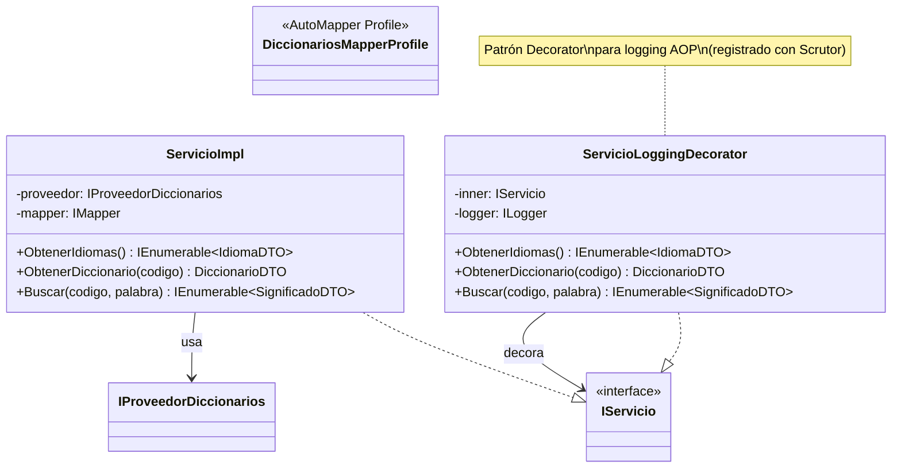

---

### Rest.V1.Api

DTOs para la API REST:

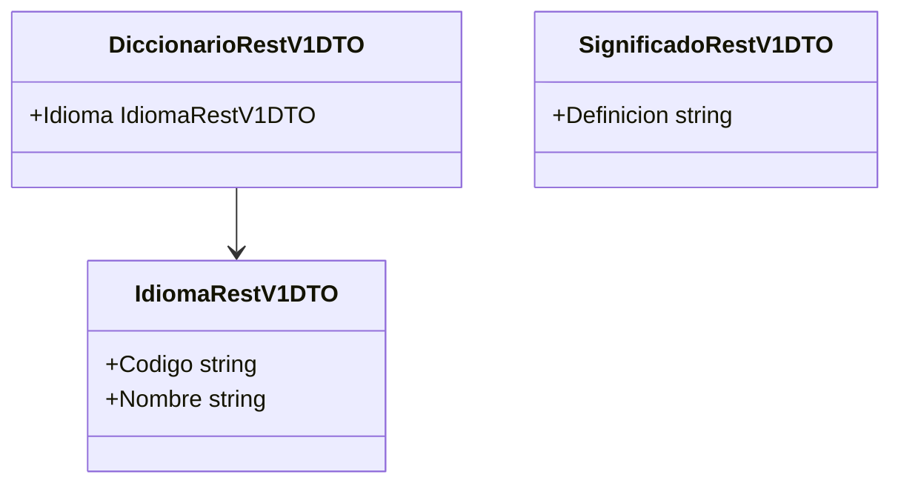

---

### Rest.V1.Impl

Controllers de la API REST:

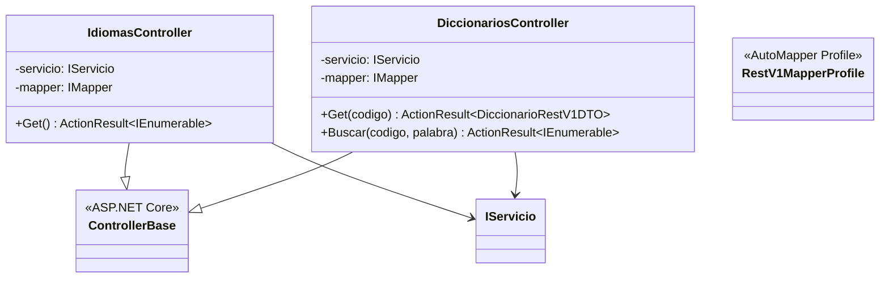

---

### UI.Api + UI.Consola

Interfaz de usuario:

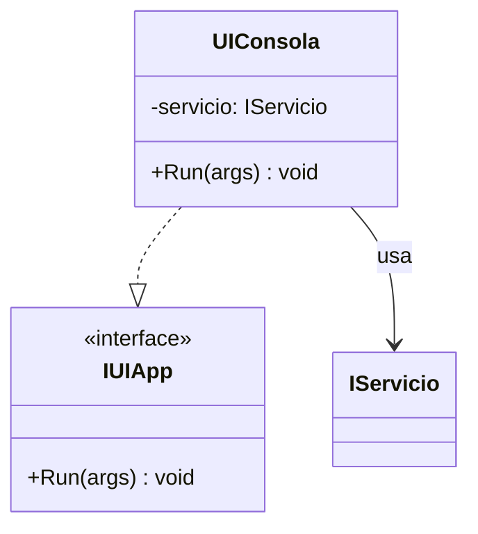

---

## 🎯 Diagramas de Componentes por Aplicación

### App.Consola

Aplicación mínima sin inyección de dependencias:

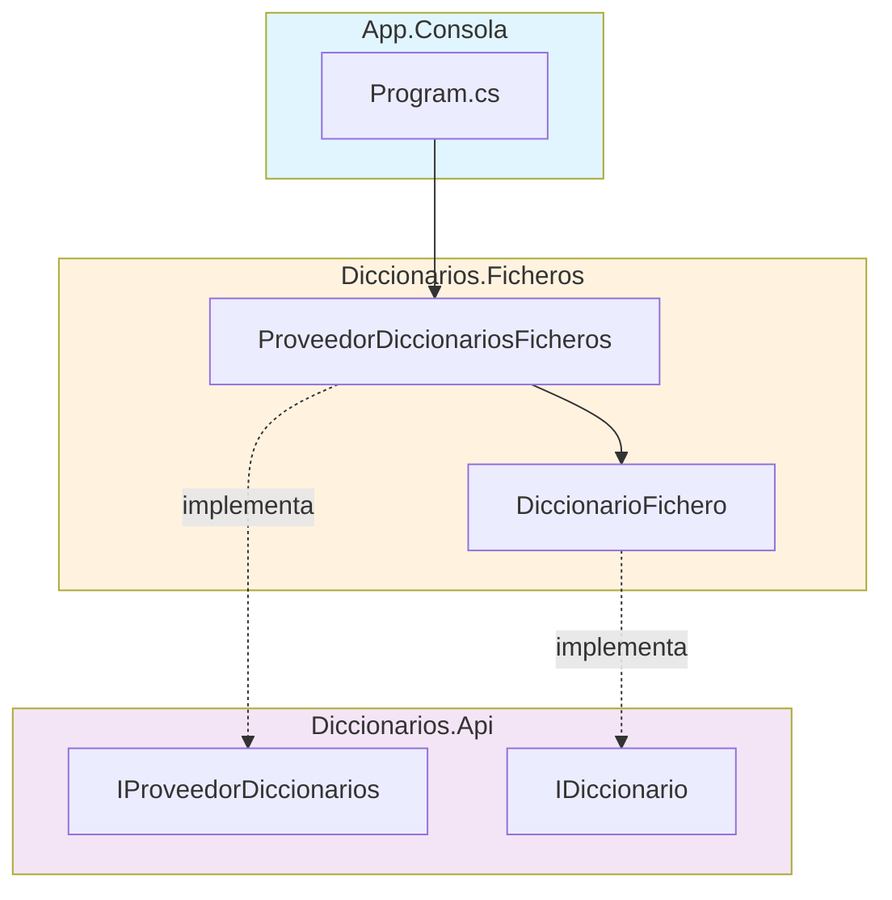

---

### App.ConsolaConDI

Aplicación con inyección de dependencias manual:

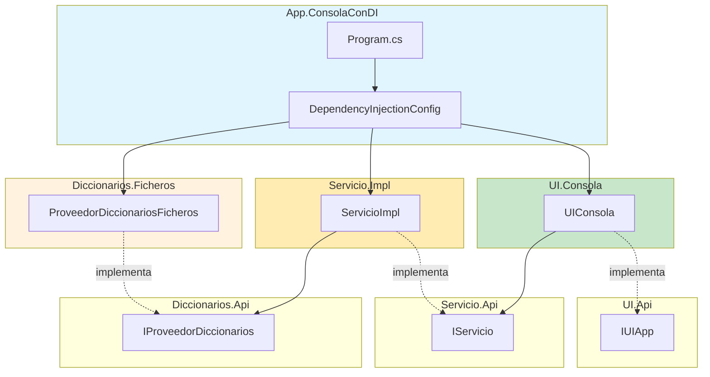

---

### App.Host

Aplicación con Microsoft.Extensions.Hosting y auto-discovery:

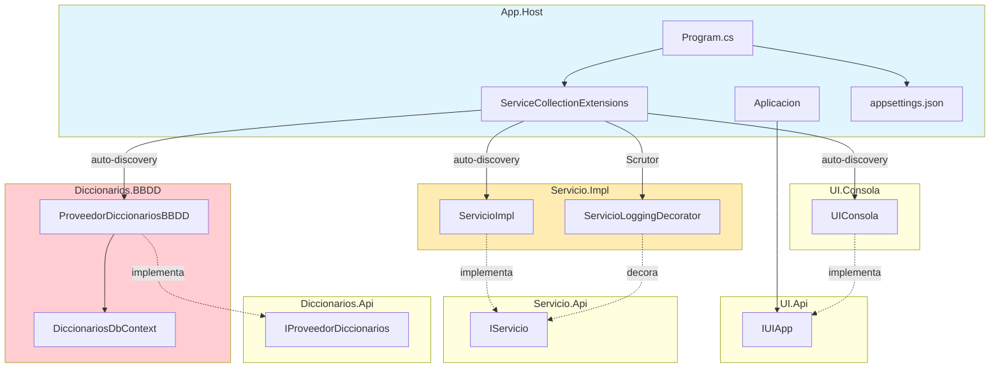

---

### App.WebApi

API REST con NSwag/Swagger:

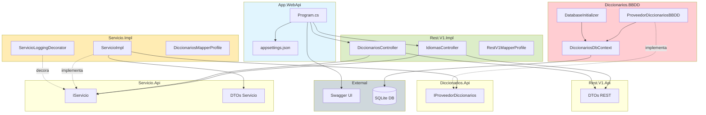

---

## 🔄 Flujo de Dependencias Global

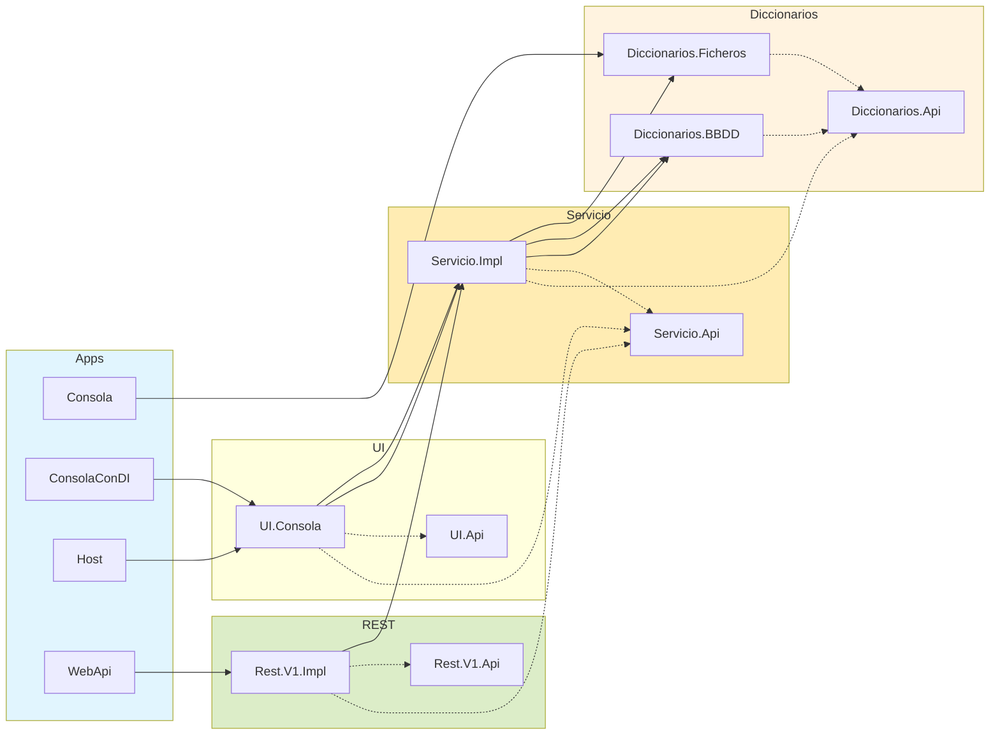

---

## 📋 Leyenda

| Símbolo | Significado |
|---------|-------------|
| `-->` | Dependencia directa |
| `-.->` | Implementa interfaz |
| `<<interface>>` | Interfaz |
| Colores por capa | Apps (azul), REST (verde), Servicio (amarillo), Diccionarios (naranja/rojo) |
